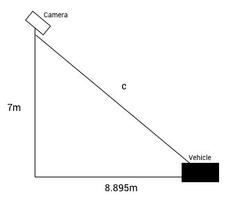

## Advanced Computer Graphics and Vision: Image Recognition Task

The application processes images of traffic travelling through a tunnel and attempts to recognise vehicles and calculate their speed and size. For instructions on usage, please see the `readme` file included with the program. 

### System Design

The first test attempted by the system is the test for a fire engine. A sample image is used, originally sampled from an image of a fire engine. The test image is segmented into a binary image, based on regions that match the mean colour of the sample. The parameters (a threshold of 100) for this segmentation were experimented with until the best results were found. Below this value, no regions would be found as the entire image would be background, and above this value the entire image would be foreground. The first test is performed here - if no regions are found to match the sample, then the image does not contain a fire engine.

However, not all red vehicles are fire engines, and so a further test is required. The `ConvexArea` property is used to find the largest region, which is assumed to be the detected vehicle. Using the `BoundingBox` property, the width and height of the region can be calculated, and thus, the width-to-height ratio. If this ratio is greater than 1:1.7, then the image contains a fire engine.

To perform the speed test, both images will need to be segmented to isolate the vehicle. Firstly, the function creates a "averaging" filter that will average pixel values within it's 10-by-10 mask. This will help to reduce noise in the image. Other filters were tested, however this was found to produce the best results.

A secondary frame can be used as a sample image, which if provided, will perform image subtraction on the main image. Areas from the sample image will be removed from the main image. This was found to be very effective at removing noise, especially in the top left of the images. If a sample image is not provided, the image is filtered using the average filter followed by conversion to binary using a threshold of 0.25. Various values were tried before this was found to produce the best results, where the smaller regions are combined into one continuous region. This is important because a vehicle's intensity pattern is not uniform, so a compromise value must be used.

Once these binary images have been produced, the speed test is applied. All of the following actions are applied to both images. The largest region is found using the `ConvexArea` property, and the region's `BoundingBox` is found. The centroid of the bounding box is calculated, which is preferred over the `Centroid` property of the region. This is because the latter is calculated from the "centre of mass" of the region, which may not reflect the actual centre of the vehicle. The distance along the y-axis between the centre of the image and the region's centroid is then found. This is converted to the number of degrees the vehicle is off-centre, shown below.

This can be solved using the following formula.

The distance between the vehicles can now be found. It is assumed that the time elapsed between the two frames is 0.1 seconds. Using this, the speed in meters per second can be calculated.

The final test performed is the oversized test. This test shares much of the speed test's approach, first calculating the vehicle's distance from the camera. Using Pythagoras' theorem, the horizontal distance between the camera and the vehicle is converted to the true distance between camera and vehicle.

The `BoundingBox`'s width in pixels is converted to degrees. Using this angle and the distance to the vehicle, the width in meters can be calculated. This is shown in the diagram below.

### Testing

The application was tested with the images provided, during the implementation phase and afterwards to ensure that it performs as expected. This was done by viewing the produced output and comparing it to the original input, estimating how effectively they match. This means that the various parameters that can be set could be adjusted until the best results were found. This reflects a real-world situation, where image recognition applications are adjusted for their purpose until the best results are achieved.

### Evaluation

The application achieves it's aims by effectively detecting vehicles and calculating their speed and size. This means that vehicles can be tested to see if they pass the rules set out in the requirements. The main success of the application is the detection of vehicles within the image. This is shown in the following images, before and after segmentation has occurred.

Another success of the application is the colour segmentation of fire engines. This allows very accurate segmentation of a specific vehicle, something that is required by the specification.

However, the application was not tested with images of different cars, with various colours and shapes. This means that it may be unsuitable for application in a non-academic scenario. For this to be achieved, the application would have to be further tested and adjusted to the distinct requirements of a real-world situation.

Image segmentation based on a subtraction approach is also problematic in some circumstances. For example if the vehicle has not moved far enough between the two frames, then the resulting image can be "cut off" where the images intersect. This can affect the calculation of the vehicle's centroid, and thus it's distance from the camera.